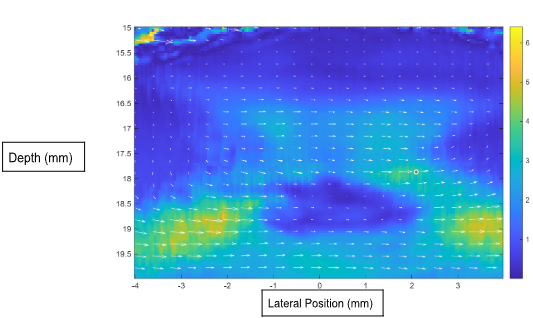

# Blood-Mimicking Fluid Analysis in Photoacoustic Imaging

## Overview

This repository contains my undergraduate physics capstone project investigating the optical and acoustic properties of blood-mimicking fluids used in photoacoustic imaging experiments. The project focuses on evaluating the strengths and weaknesses of different blood mimicking fluids for use in photoacoustic vector flow analysis.

## Objectives

* Investigate the suitability of different blood-mimicking fluids for photoacoustic imaging.
* Analyse experimental measurements obtained from different blood mimicking fluids.
* Compare observed signals with expected behaviour of rat blood.

## Methods

Experimental data were collected using a photoacoustic imaging setup and analysed using a provided analysis pipeline. Measurements focused on signal intensity, absorption behaviour, and imaging response of the phantom fluids.

## Key Outcomes

* Characterised the photoacoustic response of blood-mimicking fluid samples.
* Evaluated the reliability of phantom materials used in imaging experiments.
* Identified limitations and considerations when using synthetic fluids to simulate biological fluids.

## Report

The full project report, including methodology, analysis, figures, and discussion, is available here:

📄 **photoacoustic_blood_mimicking_fluid_analysis_report.pdf**

## Authors

G. Piper, L. Kelly, & M. Elwood – University of Auckland
